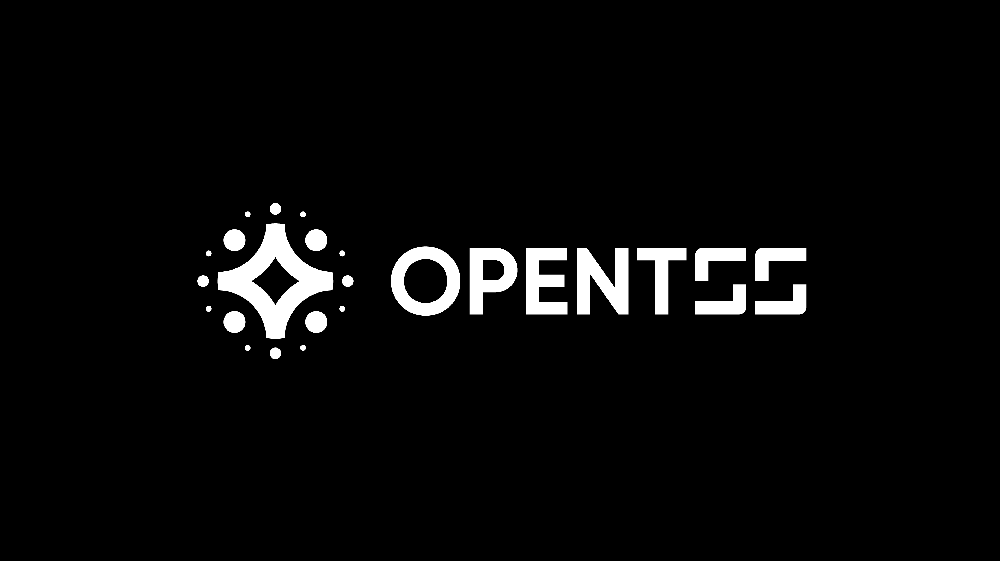

[](https://github.com/LatticeX-Foundation/opentss/actions/workflows/build.yaml)[](https://www.gnu.org/licenses/gpl-3.0)


# Open TSS

This project is a Rust implementation of multi-party {t,n}-threshold signature scheme(TSS).

The current version of this library supports [ECDSA](https://en.wikipedia.org/wiki/Elliptic_Curve_Digital_Signature_Algorithm), other algorithms such as EdDSA, BLS, etc. will be integrated soon. Please look forward to it!


## Multi-Party ECDSA

ECDSA is widely used in crypto-currencies, such as BTC, Ethereum (secp256k1 curve), etc.

The multi-party ECDSA protocol in this library is implemented based on class group. It currently includes two protocols:

- Key Generation for creating secret shares.
- Signing for using the secret shares to generate a signature. This can be divided into two phases, Offline and Online:
    - The Offline phase is independent of the message to be signed and can be calculated in advance.
    - Simply passing the message (and the output of Offline) to the Online phase, and you can get the signature very quickly.


The ECDSA in this library includes schemes described in [[DMZ+21](https://eprint.iacr.org/2022/297)](published in Asiacrypt 2021). 

| Protocol | Introduction                                                                                                                                                                                                                                                         |
| -------- | -------------------------------------------------------------------------------------------------------------------------------------------------------------------------------------------------------------------------------------------------------------------- |
| [DMZ+21] | - This paper proposes efficient multi-party threshold ECDSA protocols from CL encryptions based on class groups. <br/> - This protocol avoids the low order assumption, which is a strong and non-standard assumption, and reduces the communication cost in keygen. |


## Usage


Let's take **KeyGen** for example, only need three steps. Assuming $(t,n) = (1,3)$, party ids are 1, 2, 3.


**Step 1**: New a `Phase` object.

```rust
let partyid = "1".to_string();
let params = Parameters {
    threshold: 1,
    share_count: 3,
};
let party_ids = vec!["1".to_string(), "2".to_string(), "3".to_string()];
let mut keygen = KeyGenPhase::new(partyid, params, &Some(party_ids)).unwrap();
```


**Step 2**: Start by calling `process_begin`, which returns the message to be sent in the next round.

```rust
let sending_msg: SendingMessages = keygen.process_begin().unwrap();
```

According to the SendingMessages type(Broadcast, P2P, etc.) and content, we can package the index(from, self partyid) with the message(msg) to the other participant(s).

```rust
match sending_msg {
    SendingMessages::BroadcastMessage(msg) => {
        // broadcast the msg to all(including self).
    }
    SendingMessages::P2pMessage(msg) => {
        // send according to the k,v in the msg. k is the index which v will to be sent to.
    }
    SendingMessages::SubsetMessage(msg) => {
        // send according to the k in the party_ids or subset(used in sign phase). k is the index which msg will to be sent to.
    }
    _ => {}
}
```

**Step 3**: Handling messages by `msg_handler`. 

When a message has been received, got the recv_from and recv_msg, and then pass them into msg_handler, which returns a result or the message to be sent in the next round.


```rust
loop {
    // let (recv_from, recv_msg) = According to the last round of SendingMessages
    let recv_from = "".to_string();
    let recv_msg = vec![0u8];
    let sending_msg = keygen.msg_handler(recv_from, &recv_msg).unwrap();
    match sending_msg {
        SendingMessages::KeyGenSuccessWithResult(msg) => {
            // got the keygen result
            break;
        }
        _ => {
            // other sending messages, ref Step 2.
        }
    }
}
```

Once `SendingMessages::KeyGenSuccessWithResult` is received, it indicates completion.


- A [local test](./multi_party_ecdsa/src/protocols/multi_party/dmz21/local.rs) shows how to use these functions.

- The usage of **SignOffline**, **SignOnline** are similar to **KeyGen**. Please ref [here](docs/ECDSA.md) for more details.


## References

- [DMZ+21] <https://eprint.iacr.org/2022/297>


## Contact

You could reach us by [email](mailto:support@latticex.foundation). 

## License

The OpenTSS library is licensed under the [GNU General Public License v3.0](./LICENSE).
